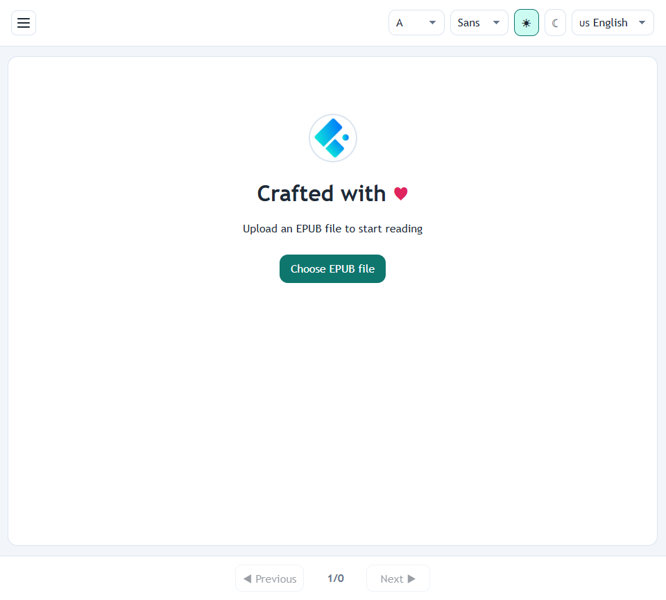
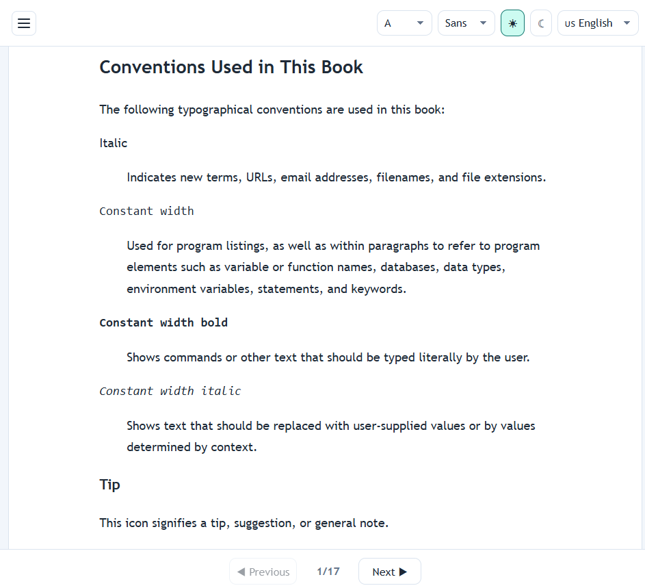

# Craft EPUB Reader

A lightweight, browser-based EPUB reader. Upload an `.epub` file and read it
directly in the browser — no server, no account, no tracking.

The interface is English by default, with Spanish available as a
translation.





## Run it

```bash
docker run --rm -p 8080:8080 craftions/app-epub-reader:latest
```

Then open `http://localhost:8080` in your browser.

## Use a different port

```bash
docker run --rm -p 9090:9090 -e PORT=9090 craftions/app-epub-reader:latest
```
Then open `http://localhost:9090` in your browser.